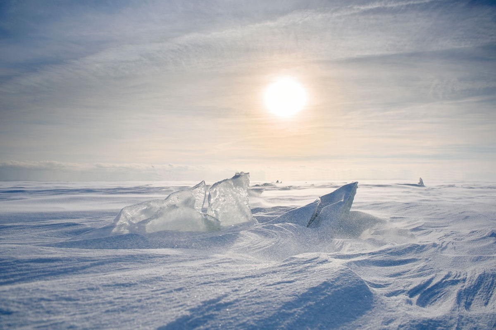
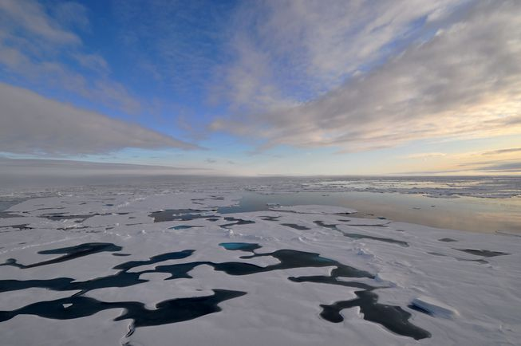

# Discover the North pole

## Thought the North Pole was out of reach? Think again...

"Who knew the North Pole had so much to offer? The serene views and peaceful undisturbed atmosphere gave ensured the my honeymoon last year was absolutely relaxing nd perfect whist the adventure opportunities and unique attractions meant thst the children never got bored. The best holiday experience ever is you ask me! I coukdn't recommend it anymore!"
-
Tessa Mayers, 2017

---

## Visit Now!
Climate change has prosed an extreme threat to the North Pole, especially over the last ten years. If change continues at this rate, it  may be your last chance to discover such a outstanding, incomparable place. Don't wait till it's too late! 
**Book Now**

## Did You Know?
- In the North Pole, during the summer the sun is always up.
- In the winter, the North Pole is approximately 28 degrees Celcius warmer thn the South Pole.
Animals that live in the North Pole include polar bears, penguins, artic fox, walruses and reindeer.

## What does the North Pole have to offer?
- Get  up close and personal with some of the North Poles most unique and captivating wildlife. [*Discover-the-Arctic-Wildlife*](##Discover-the-Arctic-Wildlife)
- Spend a night or even your whole trip at the Polar Grotto and take in the pituresque landscape in warmth and serenity.
- Tak a visit to Santa's Grotto and even get the chance to meet Santa and his reindeer themselves.
- Follow in the steps of some of the bravest explorers by taking part in one of our personalised hiking journeys led b our amazing expertee guides.

### Discover the Arctic Wildlife

-

-
pics

### The Polar Grotto

The Polar Grotto is one of the most popular hotel that the North Pole has to offer. Made up of isolated pod-like hotel rooms, this grotto allows you to take in the Arctic atmosphere privately from the peace and warmth of you own room. If you're lucky you may even be able to spot some wildlife! The Polar Grotto works to ensure your stay is as comfortable and stress-free as possible. Therefore, our main building holds a safe contained store, meaning that you will never run out of supplies. Despite the luxury feel of the accomodation, the Polar Grotto comes atone of the cheapest prices in the North Pole at only $65 a night.
**Book now to secure your place**

### Santa's Grotto

